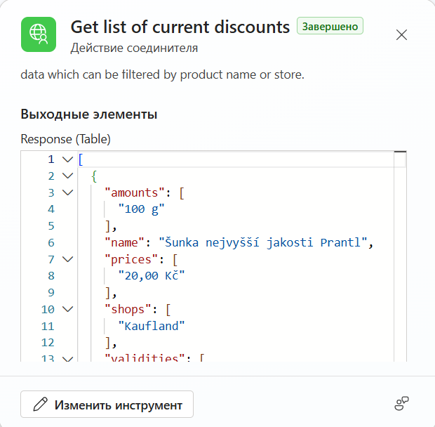
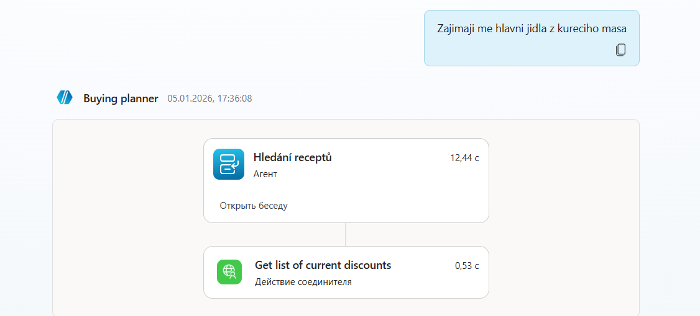
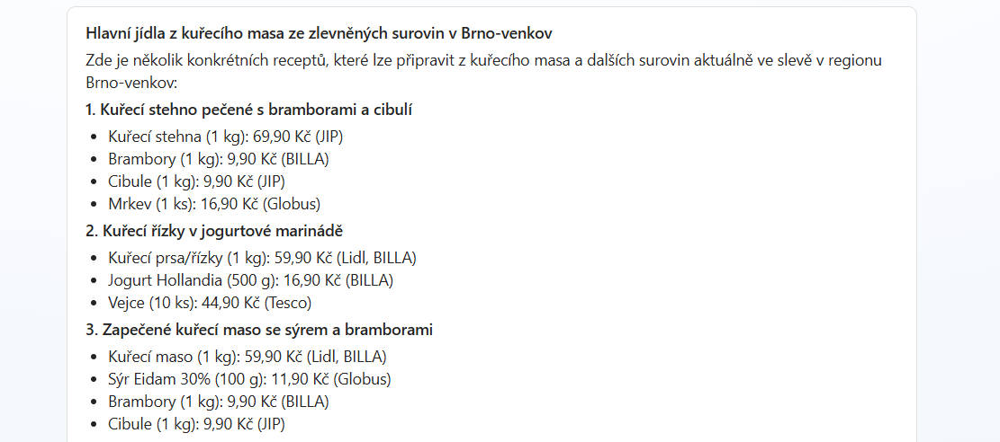
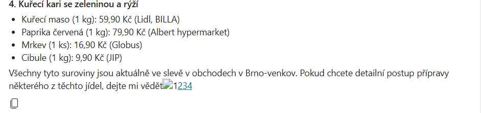

# Inteligentní kulinářský AI agent (Pet-projekt)

AI asistent vytvořený v prostředí **Microsoft Copilot Studio**, který navrhuje recepty na základě aktuálních slev v obchodech. Data o slevách byla v původním konceptu sbírána z portálu `kupi.cz`.

---

## Architektura a fungování systému

Projekt je navržen jako multiagentní systém:
1. **Dotaz uživatele:** Uživatel zadá svůj požadavek (např. *„Zajímají mě hlavní jídla z kuřecího masa“*).
2. **Hlavní agent (`Buying planner`):** Hlavní agent zachytí dotaz a přesměruje ho na specializovaného sub-agenta nebo zavolá Get list of current discounts.
3. **Sub-agent (`Hledání receptů`):** Zpracuje kulinářskou logiku a kontext dotazu.
4. **Načtení dat (`Get list of current discounts`):** Vlastní konektor vytáhne strukturovaná data o slevách (JSON), která byla předtím stažena Python skriptem.
5. **Generování přes LLM:** Agent propojí externí strukturovaná data o slevách s kreativitou LLM modelu a vygeneruje konkrétní, cenově výhodné recepty.

> **Aktuální stav:** Python skript pro web scraping momentálně není dostupný. Níže je k nahlédnutí plně ověřený a funkční Proof of Concept celého integrovaného řešení.

---

## Struktura dat (API Kontrakt)

Vlastní konektor `Get list of current discounts` vrací strukturované pole ve formátu JSON.

Každá položka obsahuje jasně definovaná pole:
* `amounts`: Pole s množstvím/váhou produktu (např. `"100 g"`).
* `name`: Přesný název produktu.
* `prices`: Akční cena v Kč.
* `shops`: Obchodní řetězce, kde akce platí (Kaufland, Lidl, BILLA...).
* `validities`: Platnost dané slevové akce.

---

## Ukázka fungování v praxi (Demo)

### 1. Průběh exekuce agenta
Při odeslání dotazu hlavní agent aktivuje sub-agenta a přes `Get list of current discounts` načte externí data o slevách:

### 2. Personalizovaný výstup z AI
Agent úspěšně vyfiltruje slevy a vypíše seznam potravin pro recepty, včetně cen a konkrétních obchodů (Lidl, BILLA, JIP, Tesco, Globus, Albert):

